# Lab 09b - Implement Azure Container Instances


## Índice

- [Descripción del laboratorio](#descripción-del-laboratorio)
- [Escenario del laboratorio](#escenario-del-laboratorio)
- [Esquema Visual del Laboratorio](#esquema-visual-del-laboratorio)
- [Habilidades adquiridas](#habilidades-adquiridas)
- [Costo Total del Laboratorio](#costo-total-del-laboratorio)
- [Desarrollo del laboratorio](#desarrollo-del-laboratorio)
  - [Tarea 1: Deploy an Azure Container Instance using a Docker Image](#tarea-1-deploy-an-azure-container-instance-using-a-docker-image)
  - [Tarea 2: Test and verify deployment of an Azure Container Instance](#tarea-2-test-and-verify-deployment-of-an-azure-container-instance)
- [Conceptos reforzados](#conceptos-reforzados)
- [Resultados esperados](#resultados-esperados)
- [Limpieza de recursos](#limpieza-de-recursos)
- [Contribuciones](#contribuciones)
- [Licencia](#licencia)

---

## Descripción del laboratorio

En este laboratorio nos enfocaremos en comprender y aplicar el servicio **Azure Container Instances (ACI)** como una alternativa ligera y flexible para ejecutar aplicaciones en contenedores dentro de la nube. La práctica busca que podamos experimentar de primera mano cómo desplegar aplicaciones empaquetadas en **Docker** sin necesidad de administrar infraestructura compleja, servidores físicos o clusters de orquestación como Kubernetes.

A lo largo de los pasos, exploraremos cómo crear un contenedor directamente desde el **Azure Portal**, configurar parámetros básicos como el grupo de recursos, la región y el nombre DNS, y finalmente validar que la aplicación se encuentra disponible públicamente. Esta experiencia nos permitirá apreciar la simplicidad de *ACI*, que elimina la necesidad de aprovisionar máquinas virtuales o balanceadores de carga, ofreciendo un entorno de ejecución inmediato y escalable.  

El laboratorio también refuerza conceptos clave de **modernización de aplicaciones**: migrar cargas de trabajo desde entornos locales hacia la nube, aprovechar imágenes Docker predefinidas y comprender cómo los contenedores aíslan dependencias para garantizar portabilidad. Además, se pone énfasis en la importancia de realizar pruebas de acceso y revisar los **logs de ejecución**, lo que nos ayuda a validar el correcto funcionamiento y a adquirir hábitos de observabilidad en entornos cloud.  

Finalmente, se incluye una sección de **limpieza de recursos**, recordándonos las buenas prácticas de administración en Azure: liberar recursos cuando ya no son necesarios para evitar costos innecesarios y mantener un entorno ordenado. En conjunto, este laboratorio constituye un paso fundamental para quienes buscamos dominar la administración de contenedores en Azure y avanzar hacia escenarios más complejos de orquestación y despliegue continuo.

---

## Escenario del laboratorio

La organización en la que trabajamos mantiene actualmente una aplicación web alojada en una máquina virtual dentro de su centro de datos local. Aunque esta solución ha sido suficiente hasta ahora, la estrategia corporativa apunta hacia una **migración completa a la nube**, buscando reducir la dependencia de infraestructura física y minimizar la carga administrativa que implica mantener múltiples servidores.  

En este contexto, surge la necesidad de evaluar alternativas que permitan ejecutar aplicaciones de manera **rápida, escalable y sin complejidad operativa**. La propuesta es utilizar **Azure Container Instances (ACI)**, un servicio que ofrece la capacidad de desplegar contenedores directamente en Azure sin necesidad de configurar máquinas virtuales, clusters de Kubernetes o balanceadores de carga adicionales.  

El escenario del laboratorio nos sitúa en el rol de administradores cloud que deben demostrar cómo una aplicación empaquetada en **Docker** puede ejecutarse en Azure con apenas unos clics y configuraciones básicas. La idea es simular un caso real de migración: pasar de un entorno local a un contenedor en la nube, accesible públicamente mediante un nombre DNS.  

Además, este ejercicio nos permite reforzar la importancia de los contenedores en la **modernización de aplicaciones**. Al empaquetar dependencias y código en una imagen Docker, garantizamos portabilidad y consistencia, lo que facilita mover aplicaciones entre distintos entornos sin cambios significativos.  

En resumen, el escenario plantea un desafío práctico: **validar que Azure Container Instances es una opción viable para ejecutar aplicaciones web en la nube**, reduciendo la necesidad de infraestructura dedicada y ofreciendo un camino sencillo hacia la adopción de arquitecturas modernas basadas en contenedores.

---

## Esquema Visual del Laboratorio

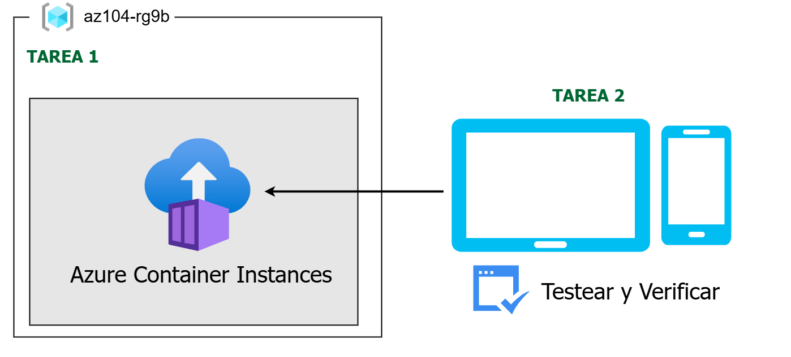

El laboratorio se centra en dos tareas principales:

1. **Desplegar un contenedor en Azure** usando una imagen Docker.
2. **Probar y verificar el despliegue** accediendo al contenedor mediante un nombre DNS público.

---

## Habilidades adquiridas

- Creación de instancias de contenedor en Azure.
- Uso de imágenes Docker en ACI.
- Configuración de parámetros básicos de red y DNS.
- Validación de despliegues mediante logs y pruebas de acceso.
- Prácticas de limpieza de recursos para optimizar costos.

---

## Costo Total del Laboratorio

El costo de este laboratorio es muy bajo, ya que se utiliza un contenedor sencillo en **Azure Container Instances (ACI)**. Los precios actuales (abril 2026) en la región **East US** son los siguientes:

- **CPU (vCPU):** $0.0486 USD por hora  
- **Memoria (GB RAM):** $0.00533 USD por hora  
- **Facturación:** por segundo, con un mínimo de 1 minuto  
- **Unidad de cobro:** grupo de contenedores (container group)

Fuente: [https://azure.microsoft.com/en-us/pricing/details/container-instances/](https://azure.microsoft.com/en-us/pricing/details/container-instances/)

### Ejemplo de cálculo para este laboratorio

El laboratorio despliega un contenedor con:

- **1 vCPU**
- **1.5 GB de memoria**
- **Duración estimada:** 15 minutos (0.25 horas)

**Cálculo:**

- CPU → 1 × $0.0486 × 0.25 h = **$0.01215 USD**  
- Memoria → 1.5 × $0.00533 × 0.25 h = **$0.00199 USD**  
- **Costo total aproximado del lab = $0.014 USD**

### Tabla de referencia

| Recurso            | Precio por hora | Uso en lab | Costo estimado |
|--------------------|-----------------|------------|----------------|
| 1 vCPU             | $0.0486 USD     | 0.25 h     | $0.01215 USD   |
| 1.5 GB RAM         | $0.00533 USD    | 0.25 h     | $0.00199 USD   |
| **Total**          | —               | —          | **$0.014 USD** |

---

### Consideraciones adicionales

- **Grupo de recursos y DNS label:** no generan costo adicional.  
- **Logs deshabilitados:** evita cargos por almacenamiento.  
- **Escalabilidad:** si se aumentan vCPUs o memoria, el costo escala linealmente.  
- **Buenas prácticas:** eliminar el grupo de recursos al finalizar el laboratorio asegura que no haya cargos residuales.  

En conclusión, el **costo real del Lab 09b es mínimo**, lo que lo convierte en un ejercicio seguro y económico para practicar con Azure Container Instances.

---

## Desarrollo del laboratorio

### Tarea 1: Deploy an Azure Container Instance using a Docker image

En esta primera tarea vamos a crear una aplicación web sencilla desplegada en un contenedor de Azure, utilizando una imagen de Docker. Docker es una plataforma que nos permite empaquetar y ejecutar aplicaciones en entornos aislados llamados **contenedores**, y **Azure Container Instances (ACI)** nos proporciona el entorno de cómputo necesario para ejecutarlos sin necesidad de administrar servidores o infraestructura adicional.

1. Iniciamos sesión en el **Azure Portal**: [https://portal.azure.com](https://portal.azure.com).

2. En el portal, buscamos **Container Instances** y seleccionamos **+ Create** para comenzar la creación de una nueva instancia.
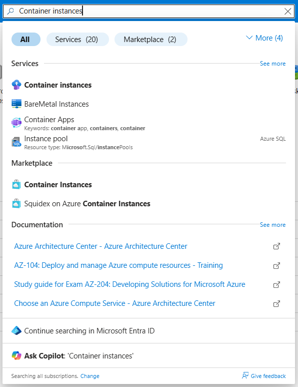
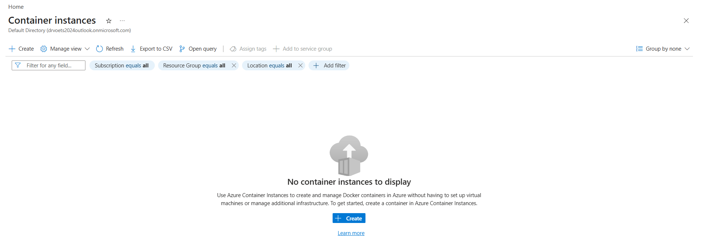

3. En la pestaña **Basics** de la hoja de creación, especificamos los siguientes valores (dejamos los demás en sus valores predeterminados):

   - **Subscription:** nuestra suscripción de Azure.
   - **Resource group:** `az104-rg9` (si es necesario, seleccionamos *Create new*).
   - **Container name:** `az104-c1`.
   - **Region:** *East US* (o una región cercana disponible).
   - **Image Source:** *Quickstart images*.
   - **Image:** `mcr.microsoft.com/azuredocs/aci-helloworld:latest` (Linux).
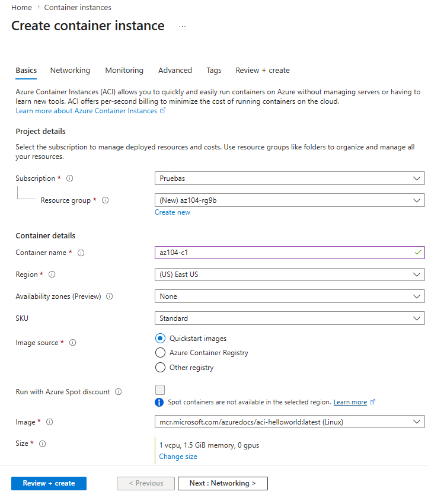

4. Seleccionamos **Next: Networking >** y configuramos:

   - **DNS name label:** un nombre válido y único a nivel global.  
     > Nota: el contenedor será accesible públicamente en la dirección `dns-name-label.region.azurecontainer.io`.  
     > Si recibimos un error indicando que el nombre no está disponible, debemos elegir otro valor.
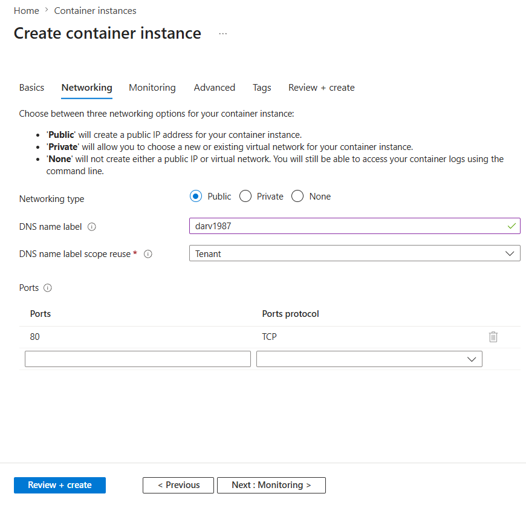

5. Seleccionamos **Next: Monitoring >** y desmarcamos la opción **Enable container instance logs**.
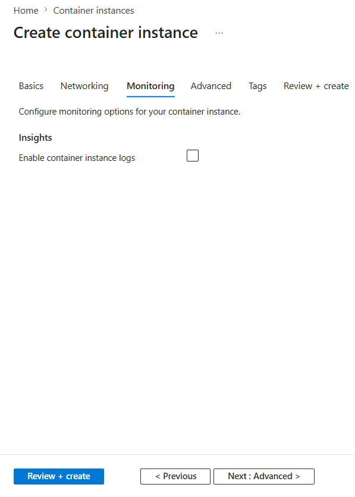

6. Seleccionamos **Next: Advanced >**, revisamos la configuración sin realizar cambios adicionales.
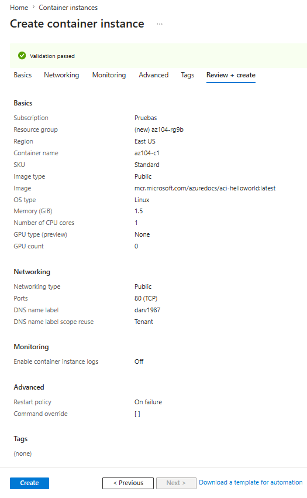

7. Finalmente, hacemos clic en **Review + Create**, verificamos que la validación sea exitosa y seleccionamos **Create** para desplegar el contenedor.

> Nota: La implementación tarda aproximadamente entre 2 y 3 minutos.  
> Mientras esperamos, podemos explorar el código detrás de la aplicación de ejemplo navegando en la carpeta `\app`.

---

### Tarea 2: Test and verify deployment of an Azure Container Instances

En esta segunda tarea vamos a revisar y validar el despliegue de la instancia de contenedor que creamos previamente. Por defecto, las instancias de contenedor en Azure son accesibles a través del **puerto 80**, lo que nos permite conectarnos mediante el nombre DNS configurado en la tarea anterior.

1. Una vez que el despliegue haya finalizado, seleccionamos el enlace **Go to resource** para acceder directamente a la instancia.
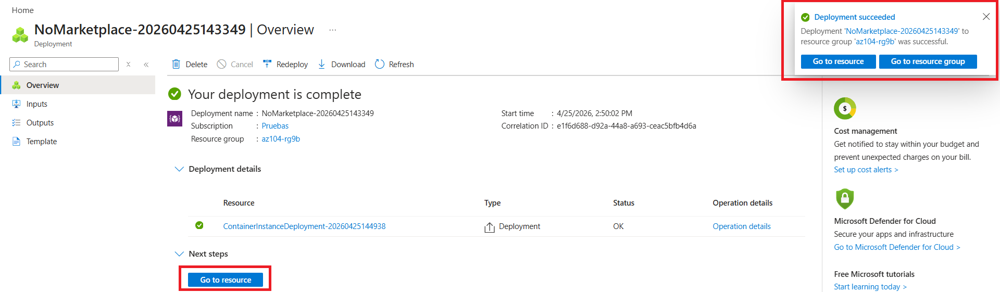

2. En la hoja **Overview** de la instancia de contenedor, verificamos que el **Status** se muestre como **Running**.
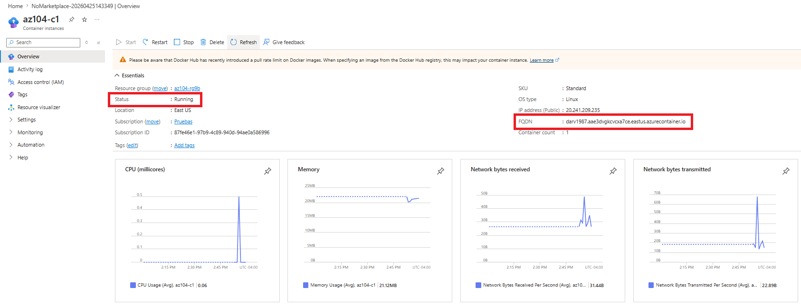

3. Copiamos el valor del **FQDN (Fully Qualified Domain Name)** de la instancia y lo abrimos en una nueva pestaña del navegador.

4. Navegamos a la URL correspondiente y comprobamos que se despliegue la página de bienvenida: **Welcome to Azure Container Instance**.
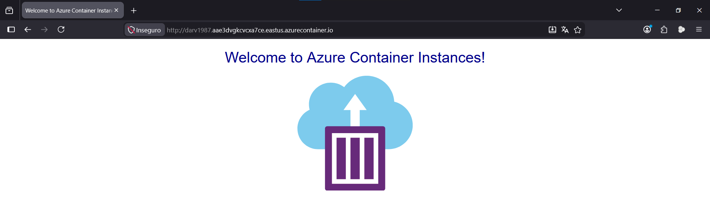

   > Podemos refrescar la página varias veces para generar entradas de log adicionales.

5. Cerramos la pestaña del navegador y regresamos al portal de Azure.

6. En la sección **Settings** de la hoja de la instancia de contenedor, seleccionamos **Containers** y luego **Logs**.
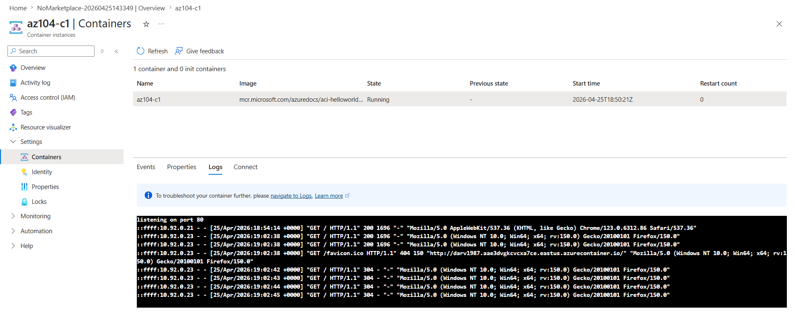

7. Verificamos que se muestren las entradas de log correspondientes a las solicitudes **HTTP GET** generadas al visualizar la aplicación en el navegador.

>Con esta tarea confirmamos que el contenedor está funcionando correctamente, que es accesible públicamente mediante el DNS configurado y que los registros reflejan la actividad de los usuarios al interactuar con la aplicación.

---

## Conceptos reforzados

- Contenedores y aislamiento de aplicaciones.
- Uso de Docker como estándar de empaquetado.
- Azure Container Instances como servicio PaaS.
- Configuración de DNS y acceso público.
- Validación de despliegues mediante logs.

---

## Resultados esperados

- Un contenedor desplegado en Azure accesible públicamente.
- Validación de logs mostrando las solicitudes HTTP.
- Comprensión práctica de cómo ACI simplifica la ejecución de aplicaciones sin infraestructura dedicada.

---

## Limpieza de recursos

Al finalizar el laboratorio es importante que liberemos los recursos creados para evitar costos innecesarios y mantener nuestro entorno de Azure ordenado. La manera más sencilla de hacerlo es eliminando directamente el **grupo de recursos** que utilizamos durante la práctica, ya que esto borra todos los recursos asociados en un solo paso.

1. En el **Azure Portal**, seleccionamos el grupo de recursos creado (`az104-rg9`), hacemos clic en **Delete resource group**, ingresamos el nombre del grupo y confirmamos la eliminación.
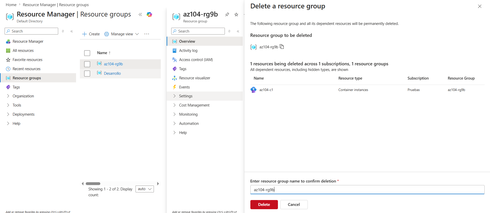

2. Si preferimos usar **Azure PowerShell**, ejecutamos el siguiente comando:

   ```powershell
   Remove-AzResourceGroup -Name az104-rg9
   ```

3. Si utilizamos la **CLI de Azure**, podemos ejecutar:

   ```bash
   az group delete --name az104-rg9
   ```

Con estos pasos aseguramos que todos los recursos del laboratorio sean eliminados correctamente, liberando capacidad en nuestra suscripción y evitando cargos adicionales.

---

## Contribuciones

Este README fue adaptado y enriquecido a partir de los materiales oficiales del laboratorio **AZ-104**.  
Se aceptan mejoras en diagramas, ejemplos de costos y traducciones adicionales.

---

## Licencia

Este contenido se basa en los laboratorios oficiales de Microsoft Learning para el examen **AZ-104 Microsoft Azure Administrator**.  
Uso educativo y de práctica profesional.
